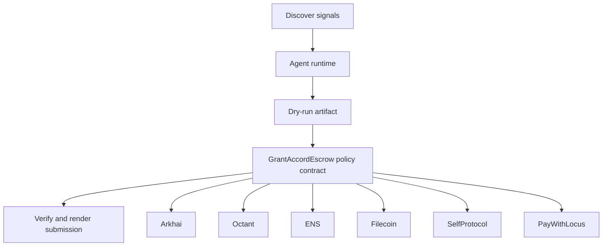

# Grant Accord Escrow

- **Repo:** `Synthesis-Arkhai`
- **Primary track:** Arkhai
- **Category:** agreements
- **Submission status:** implementation ready, waiting for credentials and TxIDs.

An escrow-ready agreement layer that turns natural-language grant or service terms into verifiable release checkpoints.

## Selected concept

The repo models natural-language agreements and escrow checkpoints for public-goods or service deals. A contract stores agreement hashes and release policies while Python scripts turn negotiation state into verifiable escrow actions.

## Idea shortlist

1. Natural-Language Grant Agreements
2. Git-Commit Trading for Public Goods
3. Escrowed Octant Deliverables

## Partners covered

Arkhai, Octant, ENS, Filecoin, SelfProtocol, PayWithLocus, Markee

## Architecture



## Repository layout

- `src/`: shared policy contracts plus the repo-specific wrapper contract.
- `script/`: Foundry deployment entrypoint.
- `agents/`: Python runtime, partner adapters, and project metadata.
- `scripts/`: CLI utilities for running the loop and rendering submissions.
- `docs/`: architecture, credentials, demo script, and security notes.
- `submissions/`: generated `synthesis.md` snippet for this repo.

## Action catalog

| Action | Partner | Purpose | Max USD | Sensitivity |
| --- | --- | --- | --- | --- |
| `arkhai_agreement_stage` | Arkhai | Use Arkhai for a bounded action in this repo. | $30 | medium |
| `octant_signal_publish` | Octant | Use Octant for a bounded action in this repo. | $25 | medium |
| `ens_ens_publish` | ENS | Use ENS for a bounded action in this repo. | $5 | low |
| `filecoin_proof_store` | Filecoin | Use Filecoin for a bounded action in this repo. | $20 | medium |
| `selfprotocol_zk_verify` | SelfProtocol | Use SelfProtocol for a bounded action in this repo. | $3 | high |
| `paywithlocus_subaccount_pay` | PayWithLocus | Use PayWithLocus for a bounded action in this repo. | $120 | medium |
| `markee_repo_message` | Markee | Use Markee for a bounded action in this repo. | $5 | low |

## Commands

```bash
python3 -m unittest discover -s tests
forge test
python3 scripts/run_agent.py
python3 scripts/plan_live_demo.py
python3 scripts/render_submission.py
```

## Credentials

| Partner | Variables | Docs |
| --- | --- | --- |
| Arkhai | ARKHAI_API_KEY, ARKHAI_ESCROW_URL | https://arkhai.ai/ |
| Octant | OCTANT_SIGNAL_URL | https://octant.app/ |
| ENS | ENS_NAME | https://docs.ens.domains/ |
| Filecoin | FILECOIN_API_TOKEN, FILECOIN_UPLOAD_URL | https://docs.filecoin.cloud/ |
| SelfProtocol | SELF_PROTOCOL_API_KEY, SELF_VERIFICATION_URL | https://docs.self.xyz/ |
| PayWithLocus | LOCUS_API_KEY, LOCUS_PAYMENT_URL | https://docs.locus.finance/ |
| Markee | MARKEE_API_KEY, MARKEE_MESSAGE_URL | https://markee.xyz/ |

## Live demo plan

1. Copy .env.example to .env and fill the required keys.
2. Deploy the contract with forge script script/Deploy.s.sol --broadcast for GrantAccordEscrow.
3. Run python3 scripts/run_agent.py to produce a dry run for arkhai_accord.
4. Set LIVE_MODE=true and rerun python3 scripts/run_agent.py with real credentials.
5. Run python3 scripts/render_submission.py and attach TxIDs plus repo links.
